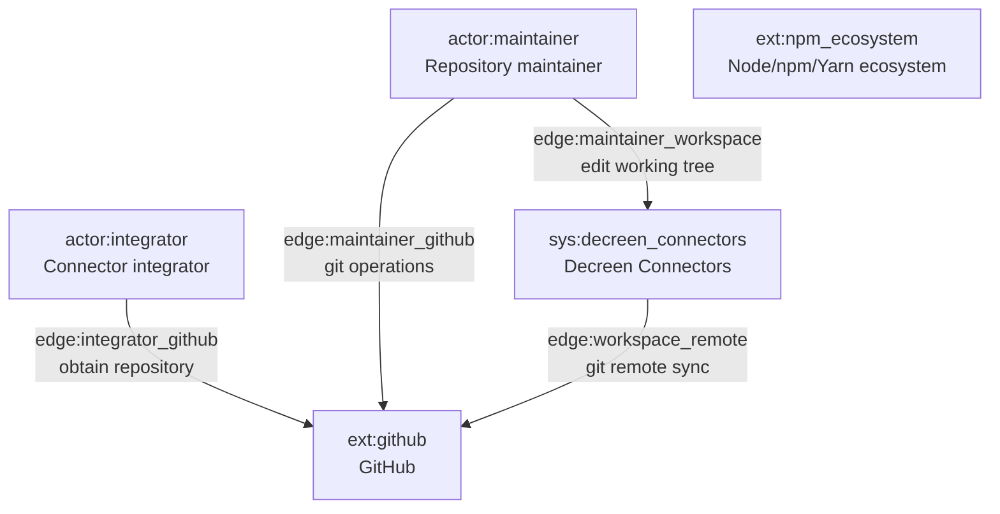
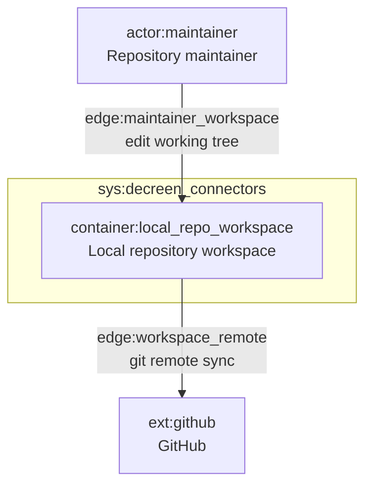
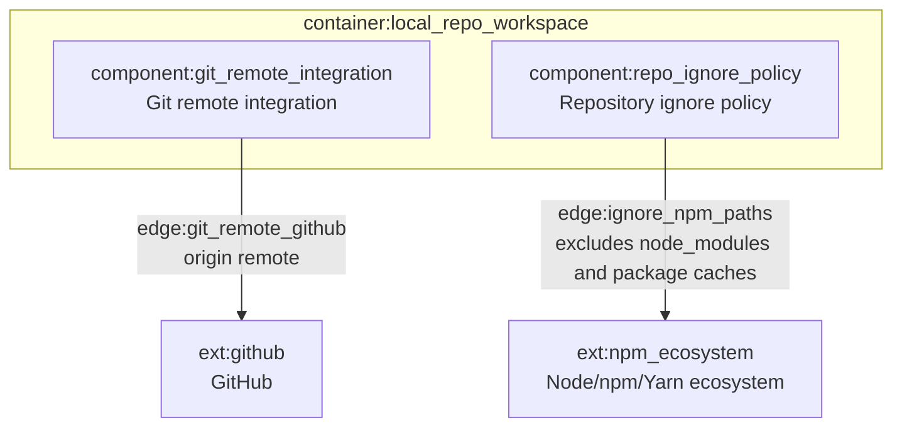

# C4 Architecture

Projections from `docs/c4-events.ndjson` (frozen through pass 4).

## L1 — System context

## L2 — Containers

## L3 — `container:local_repo_workspace`

### L3 kind annotations (from stream)

| ID | KIND (primary) |
|----|----------------|
| `component:git_remote_integration` | `integration` |
| `component:repo_ignore_policy` | `boundary` |

## Full containment map

| Parent | Child |
|--------|--------|
| `sys:decreen_connectors` | `container:local_repo_workspace` |
| `container:local_repo_workspace` | `component:git_remote_integration` |
| `container:local_repo_workspace` | `component:repo_ignore_policy` |
