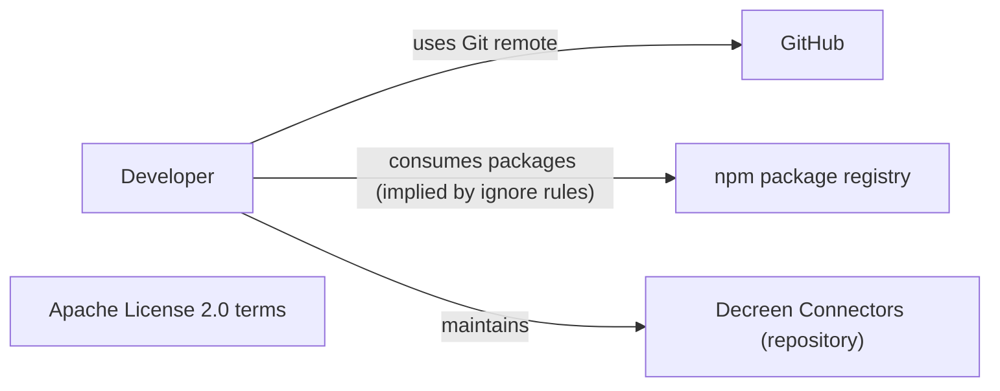
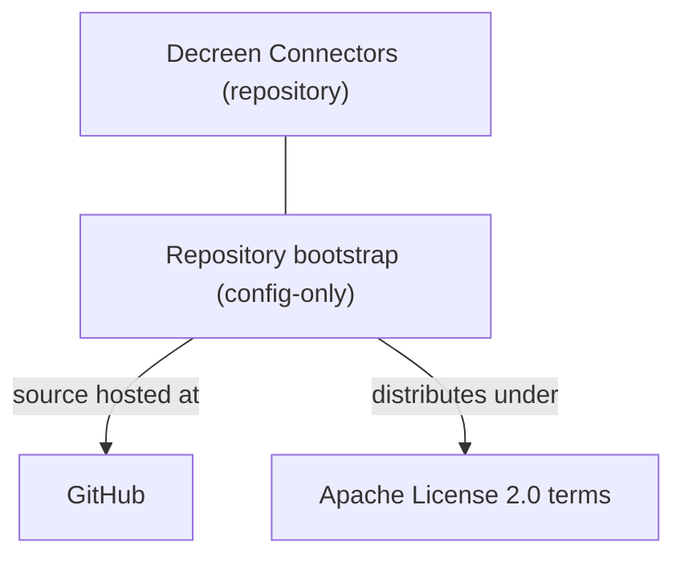
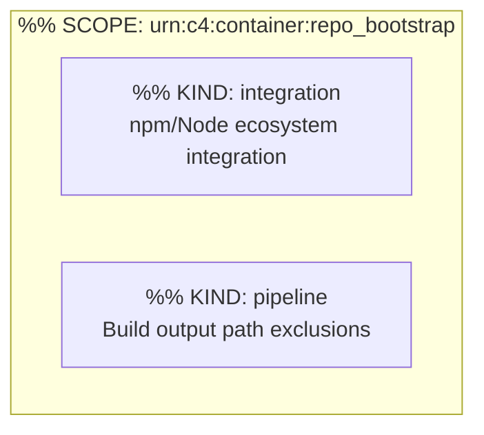

# C4 Architecture

Derived from `docs/c4-events.ndjson` (append-only stream). Pass 4 adds no new elements.

## L1 — System context



## L2 — Containers



## L3 — Components (container: `repo_bootstrap`)



## Containment Map

```json
{
  "parentToChildren": {
    "decreen_connectors": ["repo_bootstrap"],
    "repo_bootstrap": ["npm_ecosystem_integration", "build_output_pipeline"]
  },
  "childToParent": {
    "repo_bootstrap": "decreen_connectors",
    "npm_ecosystem_integration": "repo_bootstrap",
    "build_output_pipeline": "repo_bootstrap"
  }
}
```
