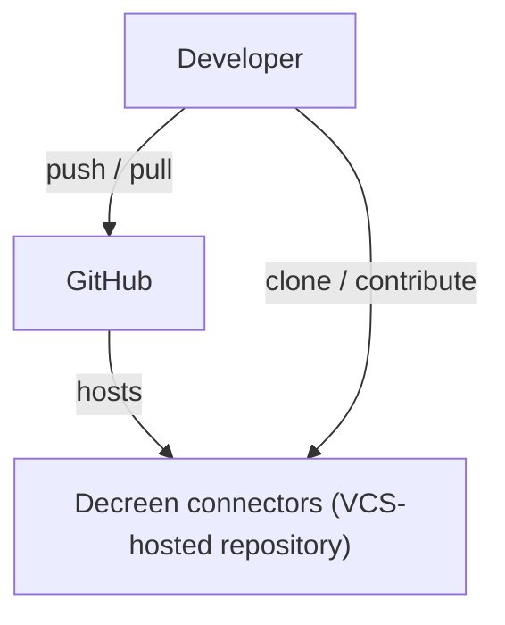
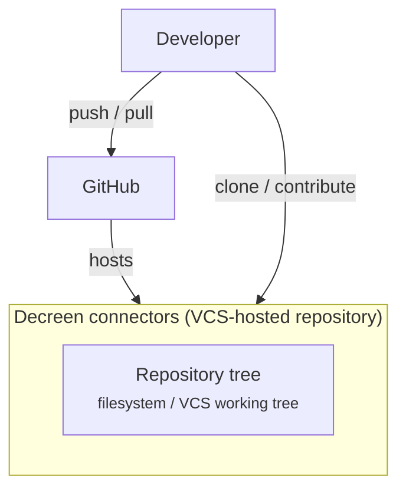
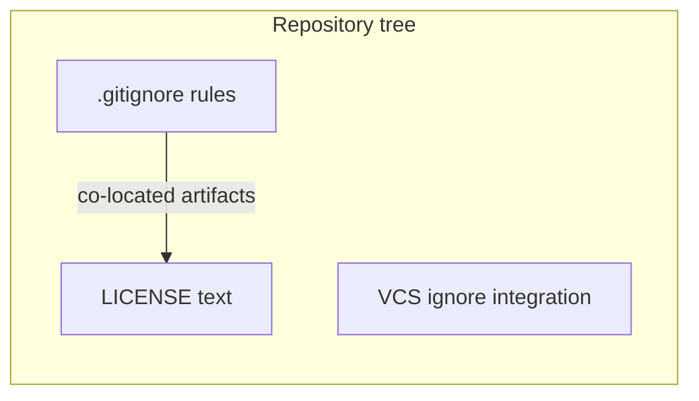

# C4 Architecture

Final projection from `docs/c4-events.ndjson` (replayed through Pass 4 freeze).

## L1 — System context



## L2 — Container diagram



## L3 — Repository tree



## Containment Map

```json
{
  "parentToChildren": {
    "sys_decreen_connectors": ["container_repository_tree"],
    "container_repository_tree": [
      "component_boundary_gitignore",
      "component_storage_license",
      "component_integration_gitignore"
    ]
  },
  "childToParent": {
    "container_repository_tree": "sys_decreen_connectors",
    "component_boundary_gitignore": "container_repository_tree",
    "component_storage_license": "container_repository_tree",
    "component_integration_gitignore": "container_repository_tree"
  }
}
```
