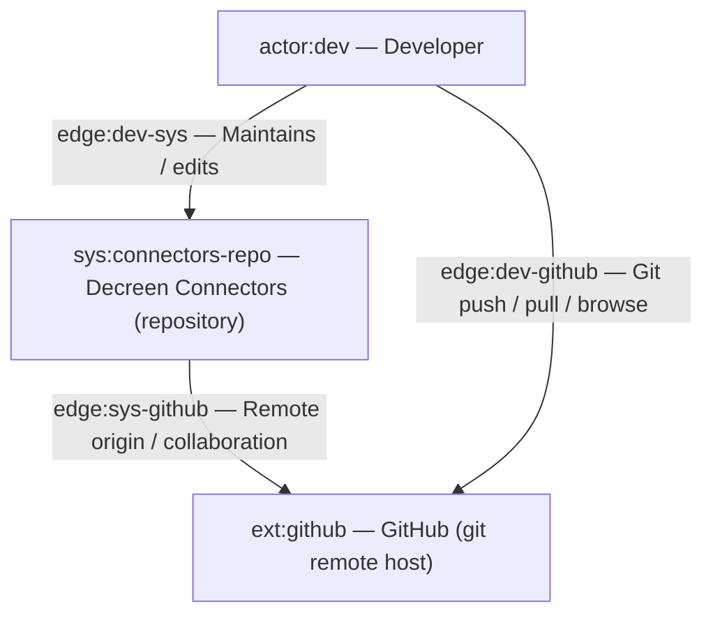
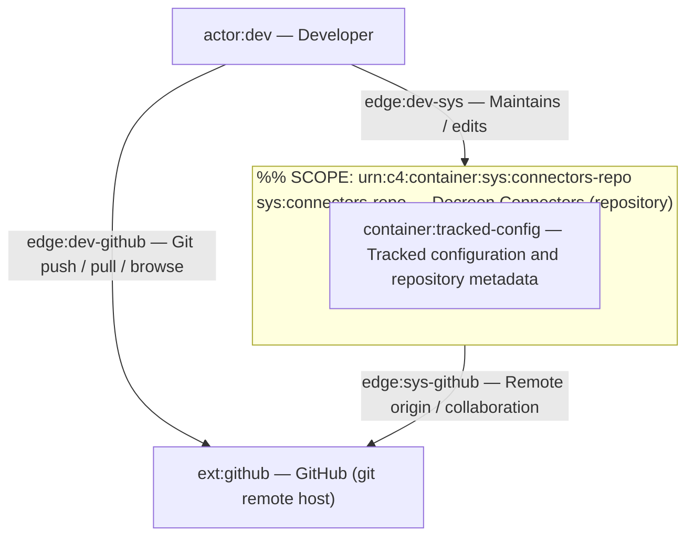
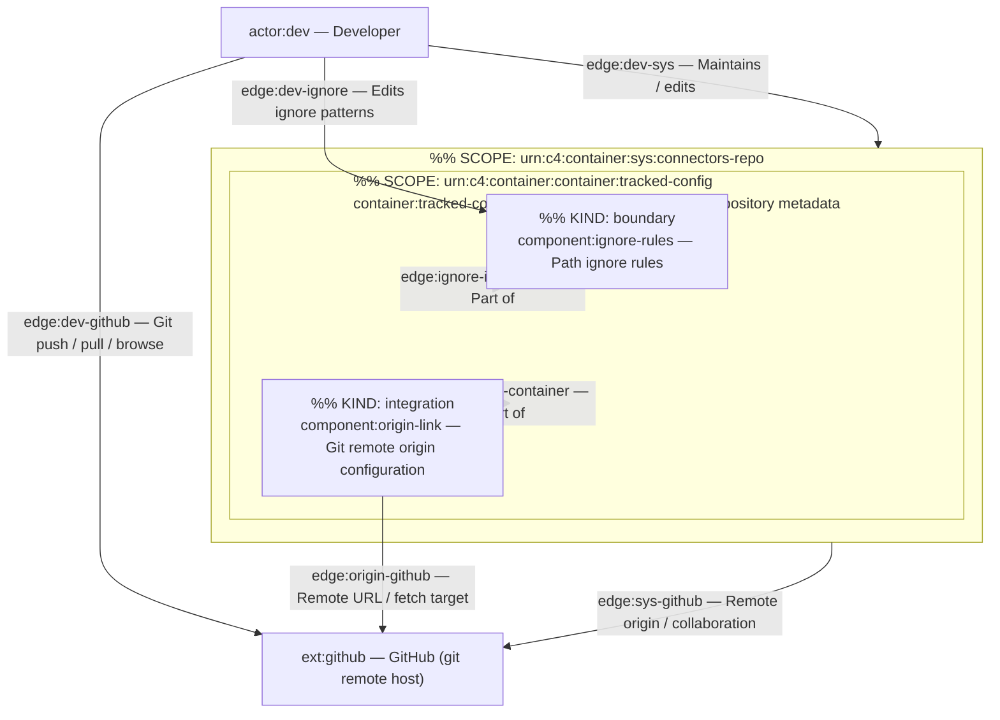

# C4 Architecture

Projections from `docs/c4-events.ndjson` (append-only). Pass 4 adds no new elements.

## L1 — System Context

## L2 — Container diagram

## L3 — container:tracked-config

## Containment map

| Element ID | Type | Contained in |
|------------|------|----------------|
| `sys:connectors-repo` | system | — |
| `container:tracked-config` | container | `sys:connectors-repo` |
| `component:ignore-rules` | component | `container:tracked-config` |
| `component:origin-link` | component | `container:tracked-config` |
