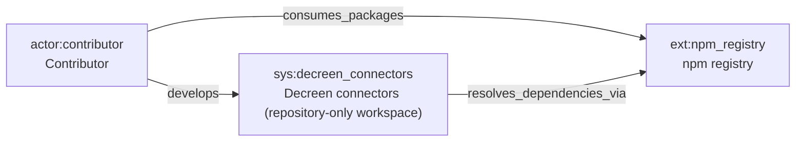
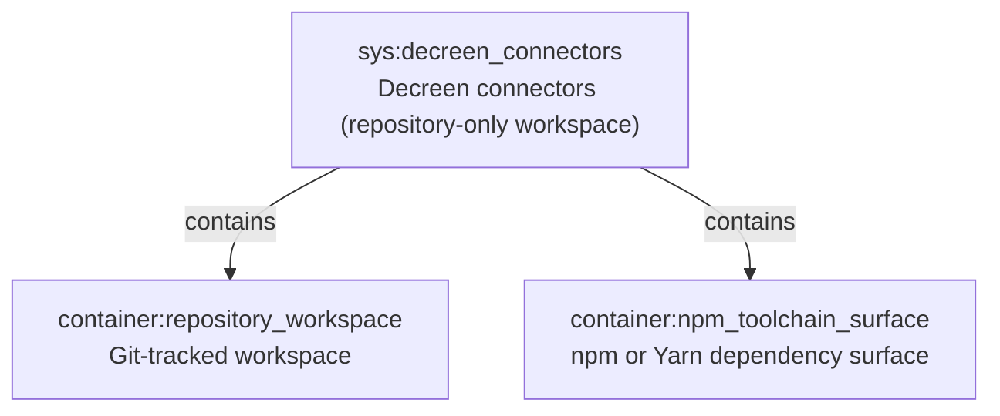
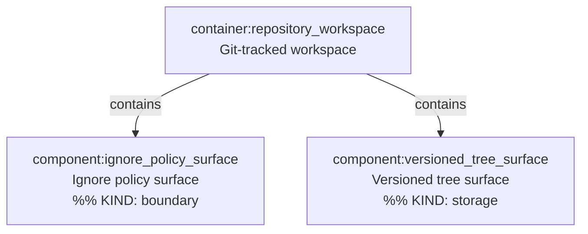
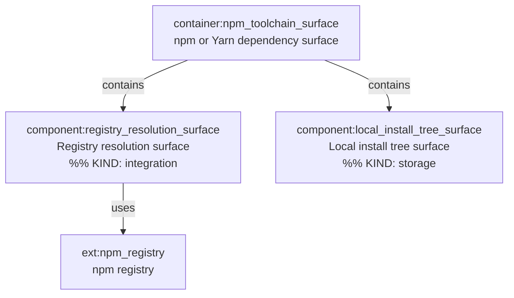

# C4 Architecture

Derived from `docs/c4-events.ndjson` (replay projection). Evidence scope: committed source and configuration only; repository currently has no application runtime beyond workspace and toolchain surfaces implied by `.gitignore`.

## L1 — System context

## L2 — Containers

## L3 — `container:repository_workspace`

## L3 — `container:npm_toolchain_surface`

## Full containment map

| Element | Contained in |
|---------|----------------|
| `sys:decreen_connectors` | _(system boundary)_ |
| `container:repository_workspace` | `sys:decreen_connectors` |
| `container:npm_toolchain_surface` | `sys:decreen_connectors` |
| `component:ignore_policy_surface` | `container:repository_workspace` |
| `component:versioned_tree_surface` | `container:repository_workspace` |
| `component:registry_resolution_surface` | `container:npm_toolchain_surface` |
| `component:local_install_tree_surface` | `container:npm_toolchain_surface` |

External: `ext:npm_registry` (not inside the system boundary).

Edges (from stream): `edge:e1` actor→ext; `edge:e2` actor→sys; `edge:e3` sys→ext; `edge:e4`–`e5` sys→containers; `edge:e6`–`e9` container→component containment; `edge:e10` component→ext.
