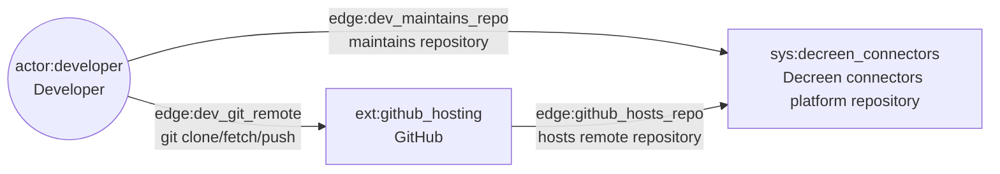
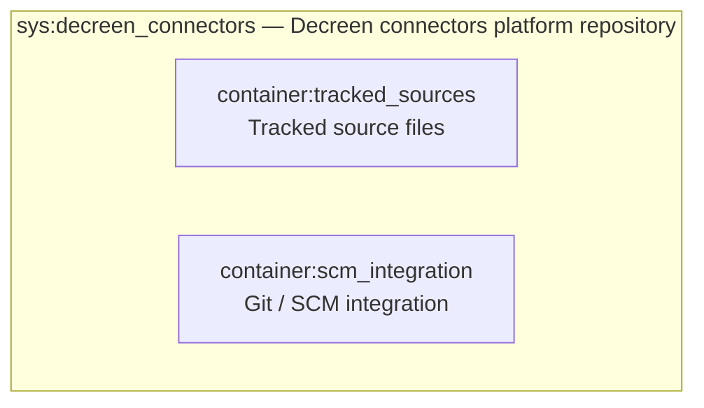
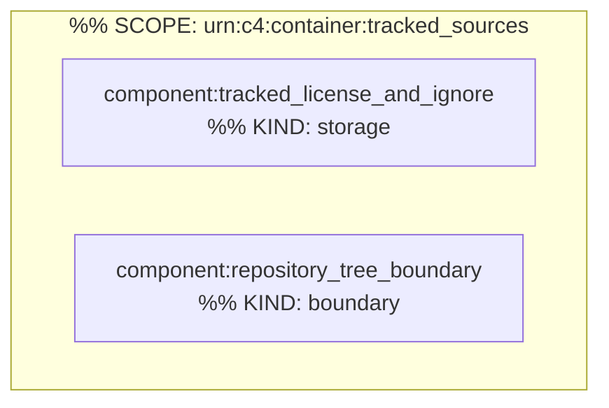
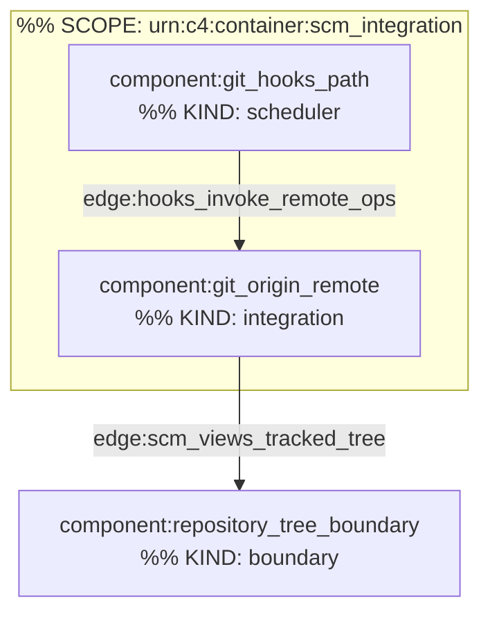

# C4 Architecture

## L1 — System context



## L2 — Container diagram



## L3 — container:tracked_sources



## L3 — container:scm_integration



## Containment Map

```json
{
  "parentToChildren": {
    "sys:decreen_connectors": ["container:tracked_sources", "container:scm_integration"],
    "container:tracked_sources": ["component:tracked_license_and_ignore", "component:repository_tree_boundary"],
    "container:scm_integration": ["component:git_origin_remote", "component:git_hooks_path"]
  },
  "childToParent": {
    "container:tracked_sources": "sys:decreen_connectors",
    "container:scm_integration": "sys:decreen_connectors",
    "component:tracked_license_and_ignore": "container:tracked_sources",
    "component:repository_tree_boundary": "container:tracked_sources",
    "component:git_origin_remote": "container:scm_integration",
    "component:git_hooks_path": "container:scm_integration"
  }
}
```
