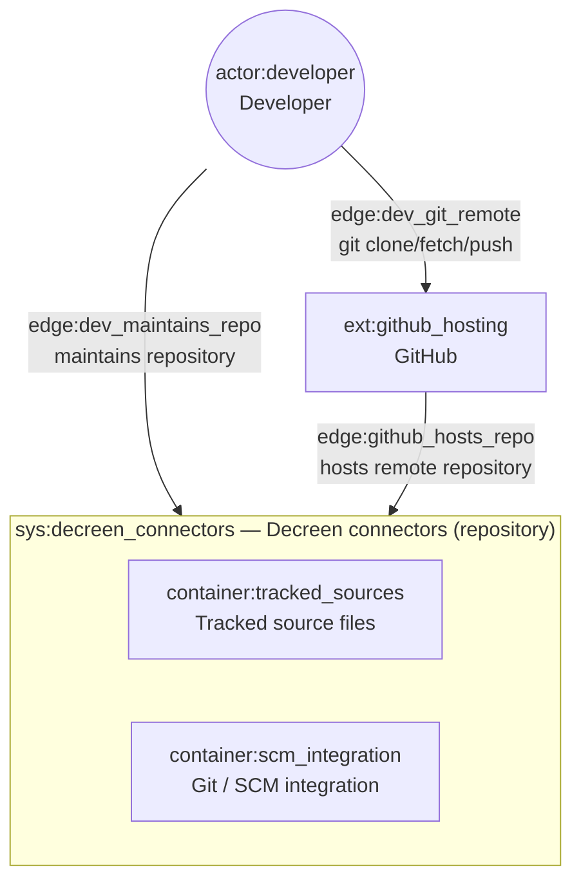

# Live C4 Preview

```mermaid
flowchart TB
  dev(("actor:developer\nDeveloper"))
  gh["ext:github_hosting\nGitHub"]
  subgraph sys_boundary["sys:decreen_connectors — Decreen connectors (repository)"]
    ctr_src["container:tracked_sources\nTracked source files"]
    ctr_git["container:scm_integration\nGit / SCM integration"]
  end
  dev -->|"edge:dev_maintains_repo\nmaintains repository"| sys_boundary
  gh -->|"edge:github_hosts_repo\nhosts remote repository"| sys_boundary
  dev -->|"edge:dev_git_remote\ngit clone/fetch/push"| gh
```
