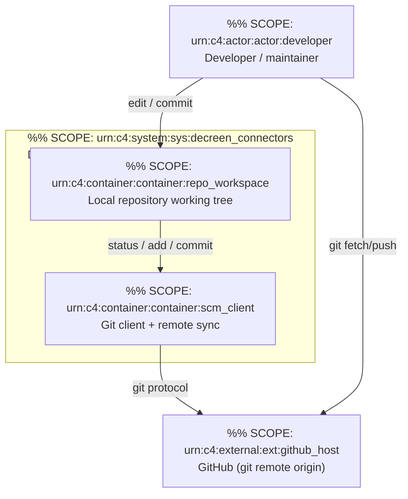

# Live C4 Preview

```mermaid
flowchart TD
  subgraph sys_decreen["%% SCOPE: urn:c4:system:sys:decreen_connectors<br/>Decreen connectors (repository workspace)"]
    c_repo["%% SCOPE: urn:c4:container:container:repo_workspace<br/>Local repository working tree"]
    c_scm["%% SCOPE: urn:c4:container:container:scm_client<br/>Git client + remote sync"]
  end
  actor_developer["%% SCOPE: urn:c4:actor:actor:developer<br/>Developer / maintainer"]
  ext_github["%% SCOPE: urn:c4:external:ext:github_host<br/>GitHub (git remote origin)"]
  actor_developer -->|"edit / commit"| c_repo
  c_repo -->|"status / add / commit"| c_scm
  c_scm -->|"git protocol"| ext_github
  actor_developer -->|"git fetch/push"| ext_github
```
