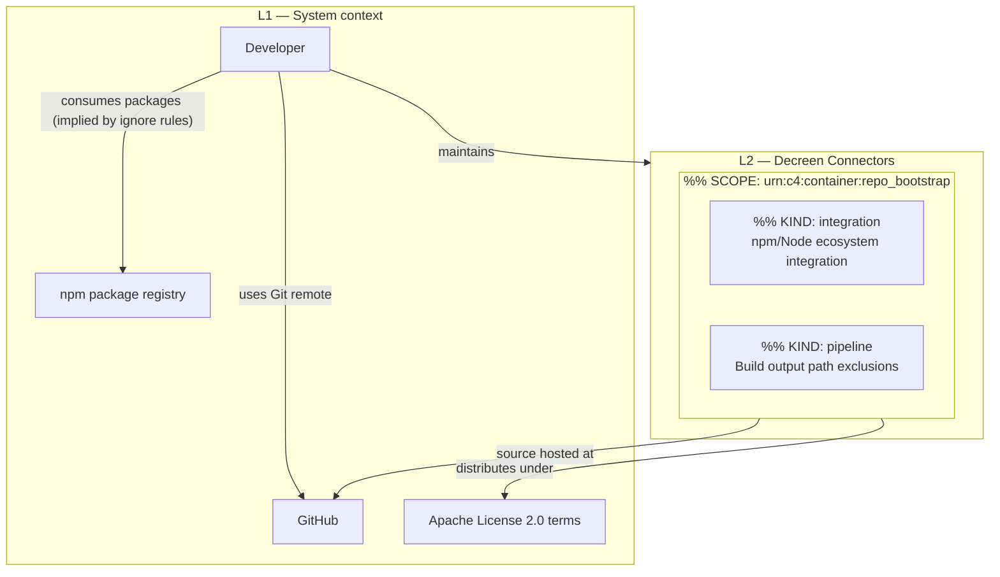

# Live C4 Preview

```mermaid
flowchart TB
  subgraph CTX["L1 — System context"]
    actor_developer["Developer"]
    ext_github["GitHub"]
    ext_npm["npm package registry"]
    ext_license["Apache License 2.0 terms"]
  end
  subgraph SYS["L2 — Decreen Connectors"]
    subgraph CTR["%% SCOPE: urn:c4:container:repo_bootstrap"]
      comp_npm["%% KIND: integration\nnpm/Node ecosystem integration"]
      comp_build["%% KIND: pipeline\nBuild output path exclusions"]
    end
  end
  actor_developer -->|"uses Git remote"| ext_github
  actor_developer -->|"consumes packages (implied by ignore rules)"| ext_npm
  actor_developer -->|"maintains"| SYS
  CTR -->|"source hosted at"| ext_github
  CTR -->|"distributes under"| ext_license
```
