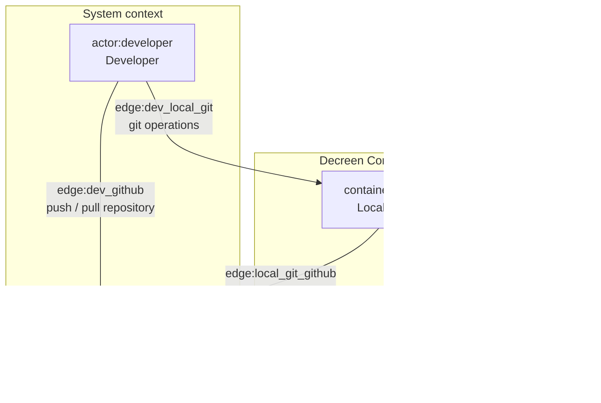

# Live C4 Preview

```mermaid
flowchart TD
  subgraph L1["System context"]
    dev["actor:developer<br/>Developer"]
    gh["ext:github_remote<br/>GitHub (git origin)"]
  end
  %% SCOPE: urn:c4:container:sys:decreen_connectors
  subgraph L2["Decreen Connectors (repository scope)"]
    local_git["container:local_git_repo<br/>Local git repository"]
    repo_files["container:repo_files<br/>Version-controlled repository files"]
  end
  dev -->|"edge:dev_github<br/>push / pull repository"| gh
  dev -->|"edge:dev_local_git<br/>git operations"| local_git
  local_git -->|"edge:local_git_github<br/>fetch / push"| gh
  local_git -->|"edge:git_tracks_files<br/>tracks"| repo_files
```
