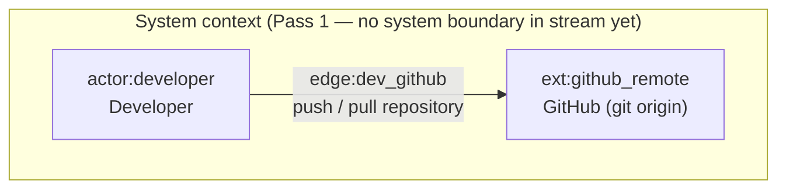

# Live C4 Preview

```mermaid
flowchart TD
  subgraph L1["System context (Pass 1 — no system boundary in stream yet)"]
    dev["actor:developer<br/>Developer"]
    gh["ext:github_remote<br/>GitHub (git origin)"]
  end
  dev -->|"edge:dev_github<br/>push / pull repository"| gh
```
