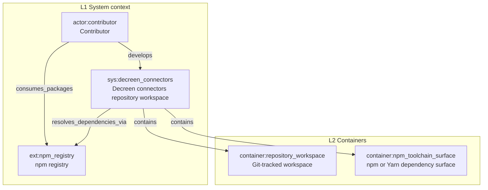

# Live C4 Preview

```mermaid
flowchart TB
  subgraph L1["L1 System context"]
    actor_contributor["actor:contributor<br/>Contributor"]
    ext_npm["ext:npm_registry<br/>npm registry"]
    sys_dc["sys:decreen_connectors<br/>Decreen connectors repository workspace"]
  end
  subgraph L2["L2 Containers"]
    c_repo["container:repository_workspace<br/>Git-tracked workspace"]
    c_npm["container:npm_toolchain_surface<br/>npm or Yarn dependency surface"]
  end
  actor_contributor -->|"consumes_packages"| ext_npm
  actor_contributor -->|"develops"| sys_dc
  sys_dc -->|"resolves_dependencies_via"| ext_npm
  sys_dc -->|"contains"| c_repo
  sys_dc -->|"contains"| c_npm
```
