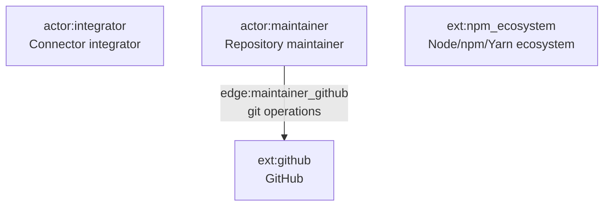

# Live C4 Preview

```mermaid
flowchart TD
  actor_integrator["actor:integrator<br/>Connector integrator"]
  actor_maintainer["actor:maintainer<br/>Repository maintainer"]
  ext_github["ext:github<br/>GitHub"]
  ext_npm["ext:npm_ecosystem<br/>Node/npm/Yarn ecosystem"]
  actor_maintainer -->|"edge:maintainer_github<br/>git operations"| ext_github
```
