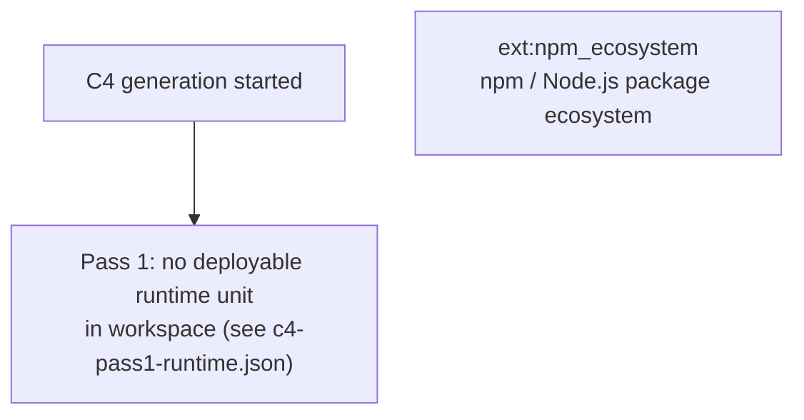

# Live C4 Preview

```mermaid
flowchart TD
  boot["C4 generation started"]
  ext_npm_ecosystem["ext:npm_ecosystem<br/>npm / Node.js package ecosystem"]
  pass1_note["Pass 1: no deployable runtime unit\nin workspace (see c4-pass1-runtime.json)"]
  boot --> pass1_note
```
