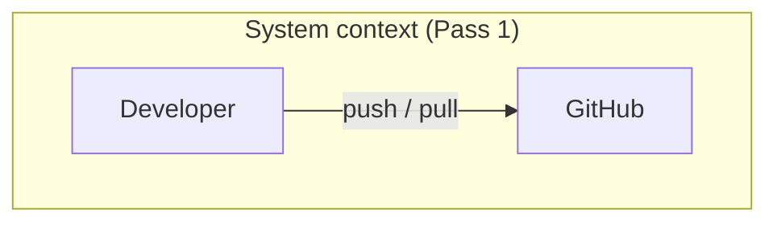

# Live C4 Preview

```mermaid
flowchart TD
  subgraph L1["System context (Pass 1)"]
    actor_developer["Developer"]
    ext_github["GitHub"]
    actor_developer -->|"push / pull"| ext_github
  end
```
