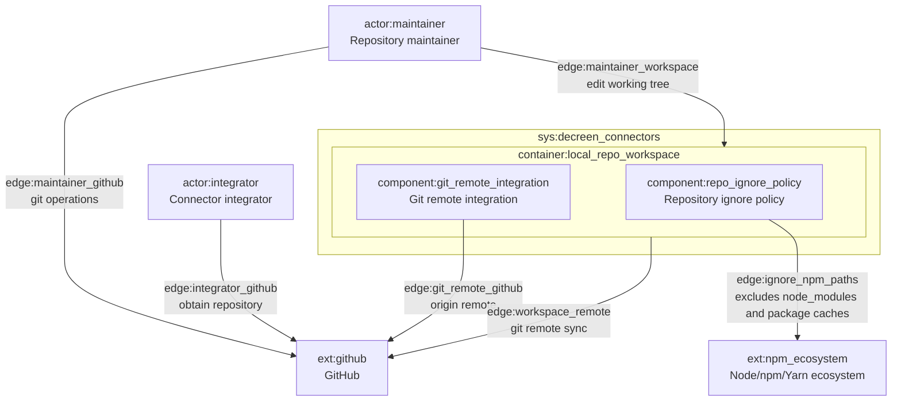

# Live C4 Preview

```mermaid
flowchart TB
  subgraph sys_decreen["sys:decreen_connectors<br/>Decreen Connectors"]
    subgraph c_workspace["container:local_repo_workspace"]
      comp_git["component:git_remote_integration<br/>Git remote integration"]
      comp_ignore["component:repo_ignore_policy<br/>Repository ignore policy"]
    end
  end
  actor_integrator["actor:integrator<br/>Connector integrator"]
  actor_maintainer["actor:maintainer<br/>Repository maintainer"]
  ext_github["ext:github<br/>GitHub"]
  ext_npm["ext:npm_ecosystem<br/>Node/npm/Yarn ecosystem"]
  actor_maintainer -->|"edge:maintainer_github<br/>git operations"| ext_github
  actor_maintainer -->|"edge:maintainer_workspace<br/>edit working tree"| c_workspace
  c_workspace -->|"edge:workspace_remote<br/>git remote sync"| ext_github
  actor_integrator -->|"edge:integrator_github<br/>obtain repository"| ext_github
  comp_git -->|"edge:git_remote_github<br/>origin remote"| ext_github
  comp_ignore -->|"edge:ignore_npm_paths<br/>excludes node_modules and package caches"| ext_npm
```
