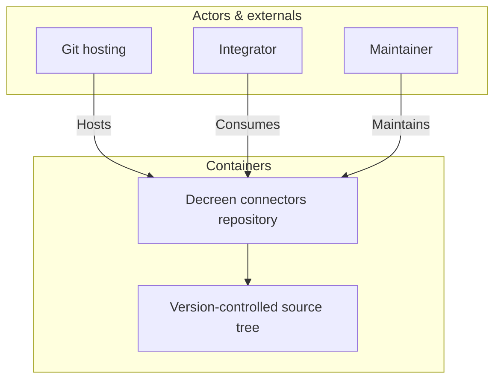

# Live C4 Preview

```mermaid
flowchart TB
  subgraph L1["Actors & externals"]
    integrator["Integrator"]
    maintainer["Maintainer"]
    git_host["Git hosting"]
  end
  subgraph L2["Containers"]
    sys["Decreen connectors repository"]
    src["Version-controlled source tree"]
  end
  git_host -->|"Hosts"| sys
  integrator -->|"Consumes"| sys
  maintainer -->|"Maintains"| sys
  sys --> src
```
