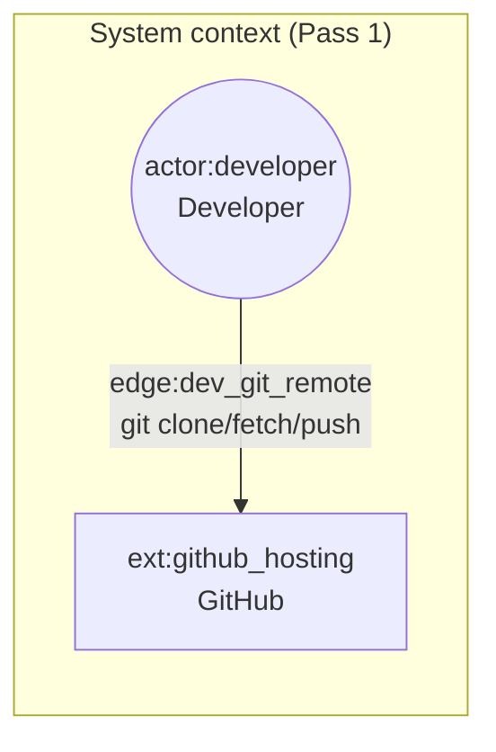

# Live C4 Preview

```mermaid
flowchart LR
  subgraph L1["System context (Pass 1)"]
    dev(("actor:developer\nDeveloper"))
    gh["ext:github_hosting\nGitHub"]
    dev -->|"edge:dev_git_remote\ngit clone/fetch/push"| gh
  end
```
