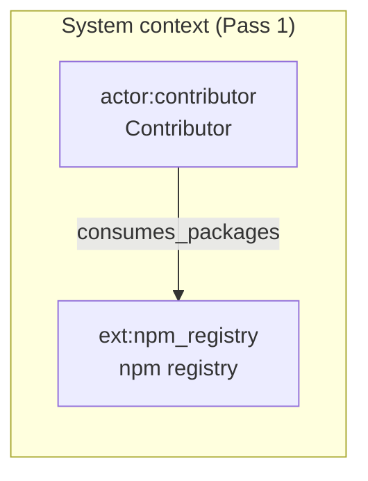

# Live C4 Preview

```mermaid
flowchart LR
  subgraph L1["System context (Pass 1)"]
    actor_contributor["actor:contributor<br/>Contributor"]
    ext_npm["ext:npm_registry<br/>npm registry"]
  end
  actor_contributor -->|"consumes_packages"| ext_npm
```
