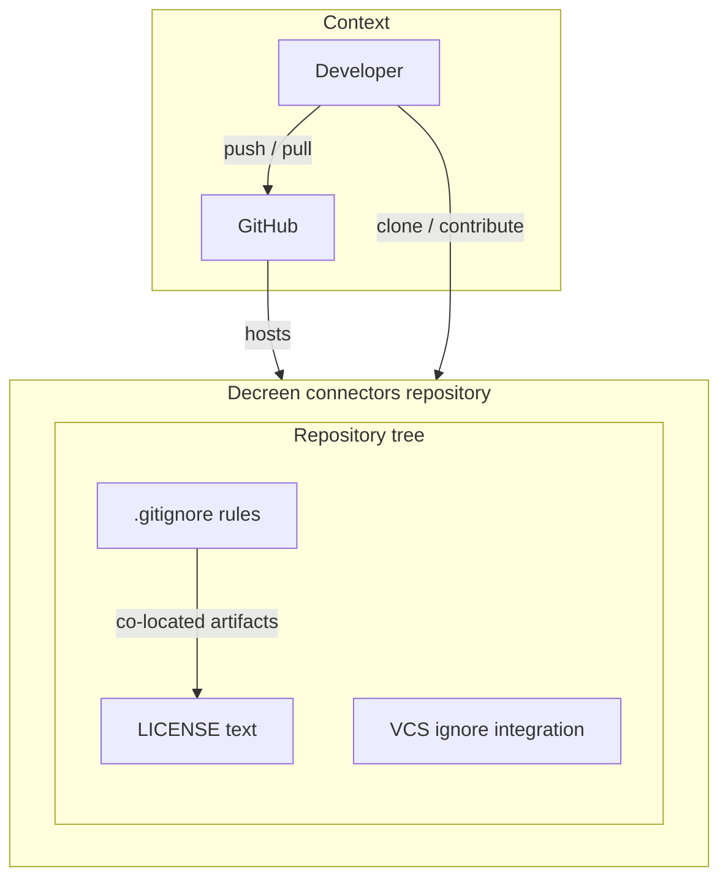

# Live C4 Preview

```mermaid
flowchart TB
  subgraph L1["Context"]
    actor_developer["Developer"]
    ext_github["GitHub"]
    actor_developer -->|"push / pull"| ext_github
  end
  subgraph sys_decreen_connectors["Decreen connectors repository"]
    subgraph container_repository_tree["Repository tree"]
      direction TB
      component_boundary_gitignore[".gitignore rules"]
      component_storage_license["LICENSE text"]
      component_integration_gitignore["VCS ignore integration"]
      component_boundary_gitignore -->|"co-located artifacts"| component_storage_license
    end
  end
  ext_github -->|"hosts"| sys_decreen_connectors
  actor_developer -->|"clone / contribute"| sys_decreen_connectors
```
