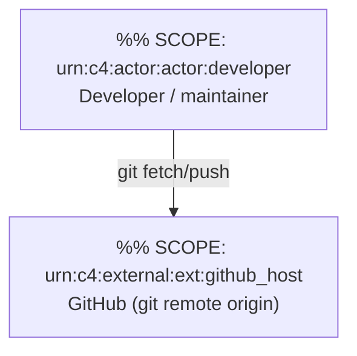

# Live C4 Preview

```mermaid
flowchart TD
  actor_developer["%% SCOPE: urn:c4:actor:actor:developer<br/>Developer / maintainer"]
  ext_github["%% SCOPE: urn:c4:external:ext:github_host<br/>GitHub (git remote origin)"]
  actor_developer -->|"git fetch/push"| ext_github
```
