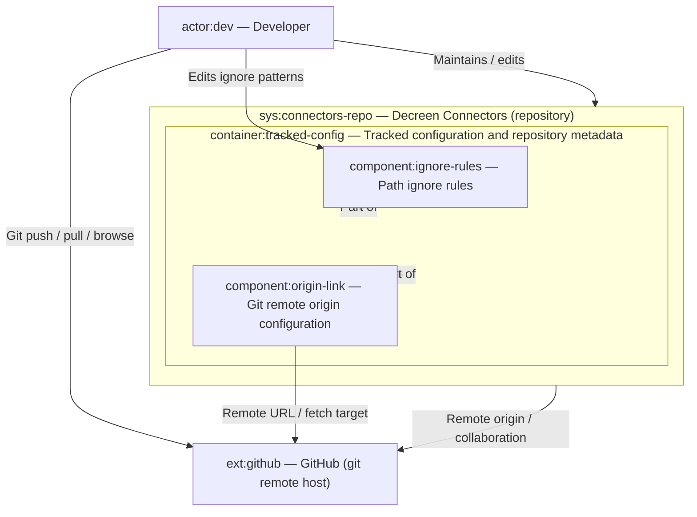

# Live C4 Preview

```mermaid
flowchart TB
  actor_dev["actor:dev — Developer"]
  ext_github["ext:github — GitHub (git remote host)"]
  subgraph sys_connectors["sys:connectors-repo — Decreen Connectors (repository)"]
    subgraph container_tracked["container:tracked-config — Tracked configuration and repository metadata"]
      component_ignore["component:ignore-rules — Path ignore rules"]
      component_origin["component:origin-link — Git remote origin configuration"]
    end
  end
  actor_dev -->|"Maintains / edits"| sys_connectors
  sys_connectors -->|"Remote origin / collaboration"| ext_github
  actor_dev -->|"Git push / pull / browse"| ext_github
  actor_dev -->|"Edits ignore patterns"| component_ignore
  component_origin -->|"Remote URL / fetch target"| ext_github
  component_ignore -->|"Part of"| container_tracked
  component_origin -->|"Part of"| container_tracked
```
