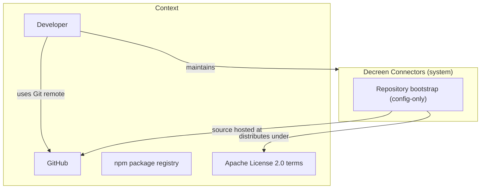

# Live C4 Preview

```mermaid
flowchart TB
  subgraph L1["Context"]
    actor_developer["Developer"]
    ext_github["GitHub"]
    ext_npm["npm package registry"]
    ext_license["Apache License 2.0 terms"]
  end
  subgraph L2["Decreen Connectors (system)"]
    ctr_bootstrap["Repository bootstrap (config-only)"]
  end
  actor_developer -->|"uses Git remote"| ext_github
  actor_developer -->|"maintains"| L2
  ctr_bootstrap -->|"source hosted at"| ext_github
  ctr_bootstrap -->|"distributes under"| ext_license
```
