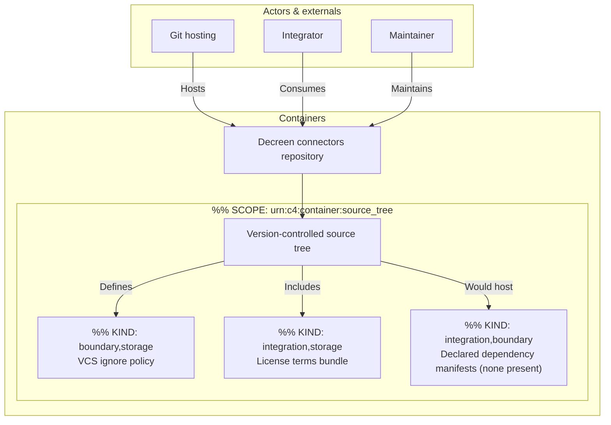

# Live C4 Preview

```mermaid
flowchart TB
  subgraph L1["Actors & externals"]
    integrator["Integrator"]
    maintainer["Maintainer"]
    git_host["Git hosting"]
  end
  subgraph L2["Containers"]
    sys["Decreen connectors repository"]
    subgraph src_scope["%% SCOPE: urn:c4:container:source_tree"]
      src["Version-controlled source tree"]
      ign["%% KIND: boundary,storage<br/>VCS ignore policy"]
      lic["%% KIND: integration,storage<br/>License terms bundle"]
      dep["%% KIND: integration,boundary<br/>Declared dependency manifests (none present)"]
    end
  end
  git_host -->|"Hosts"| sys
  integrator -->|"Consumes"| sys
  maintainer -->|"Maintains"| sys
  sys --> src
  src -->|"Defines"| ign
  src -->|"Includes"| lic
  src -->|"Would host"| dep
```
