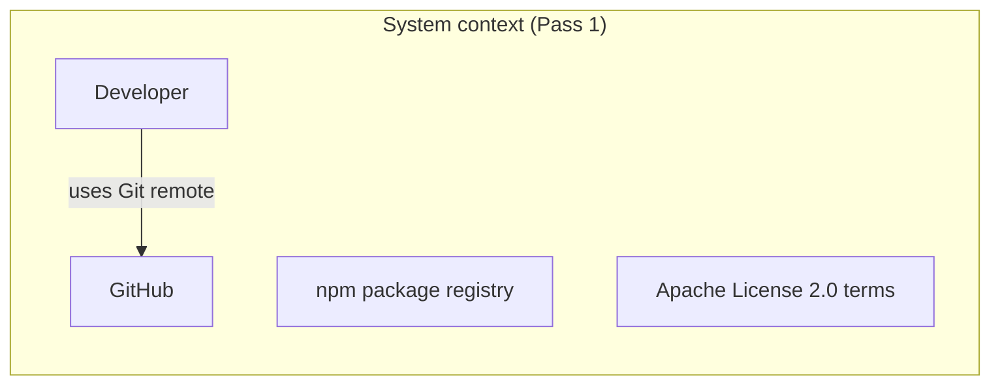

# Live C4 Preview

```mermaid
flowchart LR
  subgraph L1["System context (Pass 1)"]
    actor_developer["Developer"]
    ext_github["GitHub"]
    ext_npm["npm package registry"]
    ext_license["Apache License 2.0 terms"]
  end
  actor_developer -->|"uses Git remote"| ext_github
```
