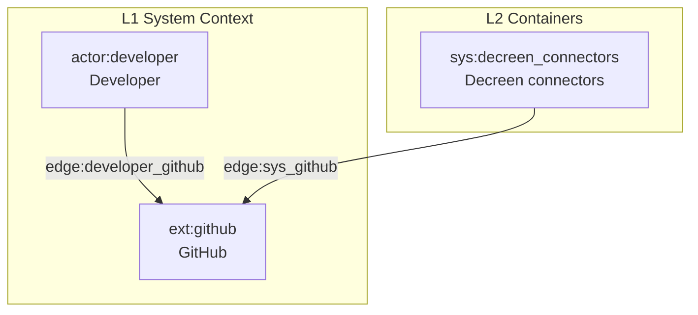

# Live C4 Preview

```mermaid
flowchart TB
  subgraph L1["L1 System Context"]
    A_DEV["actor:developer\nDeveloper"]
    EXT_GH["ext:github\nGitHub"]
    A_DEV -->|"edge:developer_github"| EXT_GH
  end
  subgraph L2["L2 Containers"]
    SYS_DC["sys:decreen_connectors\nDecreen connectors"]
    SYS_DC -->|"edge:sys_github"| EXT_GH
  end
```
