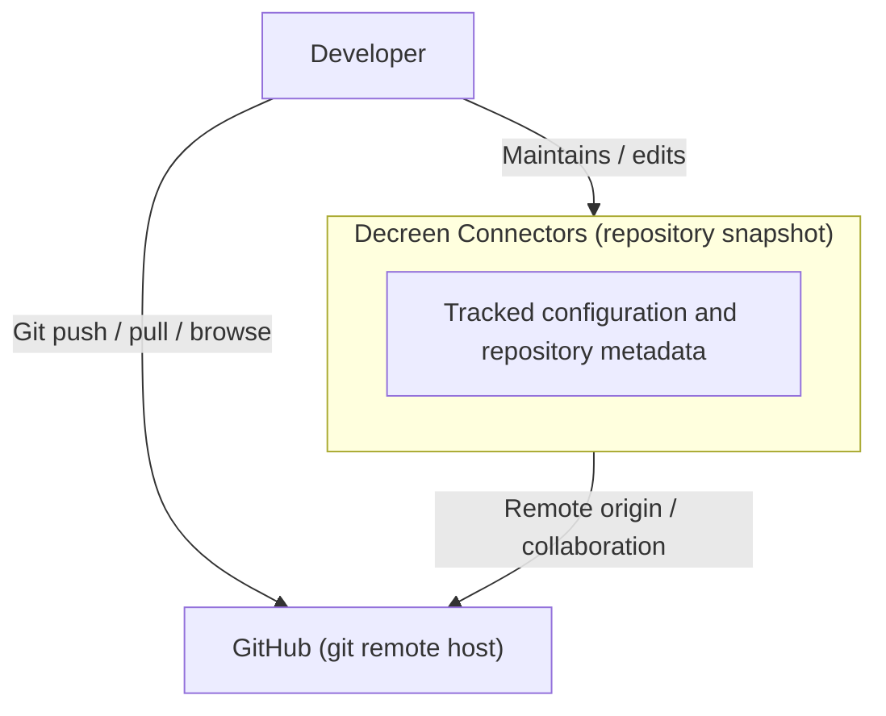

# Live C4 Preview

```mermaid
flowchart TB
  actor_dev["Developer"]
  ext_github["GitHub (git remote host)"]
  subgraph sys_connectors["Decreen Connectors (repository snapshot)"]
    container_tracked["Tracked configuration and repository metadata"]
  end
  actor_dev -->|"Maintains / edits"| sys_connectors
  sys_connectors -->|"Remote origin / collaboration"| ext_github
  actor_dev -->|"Git push / pull / browse"| ext_github
```
