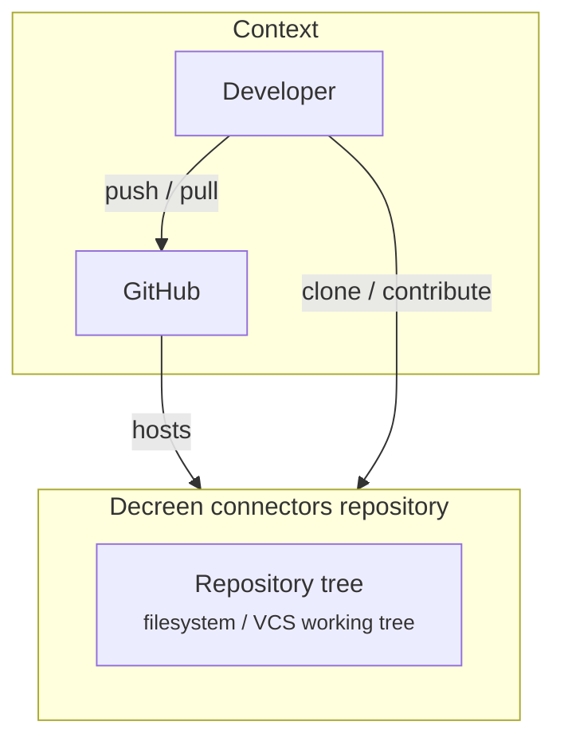

# Live C4 Preview

```mermaid
flowchart TB
  subgraph L1["Context"]
    actor_developer["Developer"]
    ext_github["GitHub"]
    actor_developer -->|"push / pull"| ext_github
  end
  subgraph sys_decreen_connectors["Decreen connectors repository"]
    container_repository_tree["Repository tree<br/><small>filesystem / VCS working tree</small>"]
  end
  ext_github -->|"hosts"| sys_decreen_connectors
  actor_developer -->|"clone / contribute"| sys_decreen_connectors
```
