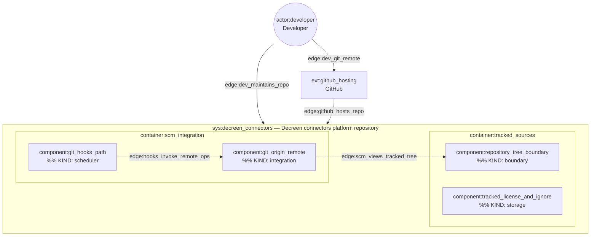

# Live C4 Preview

```mermaid
flowchart TB
  dev(("actor:developer\nDeveloper"))
  gh["ext:github_hosting\nGitHub"]
  subgraph sys_boundary["sys:decreen_connectors — Decreen connectors platform repository"]
    subgraph ctr_src["container:tracked_sources"]
      c1["component:tracked_license_and_ignore\n%% KIND: storage"]
      c2["component:repository_tree_boundary\n%% KIND: boundary"]
    end
    subgraph ctr_git["container:scm_integration"]
      c3["component:git_origin_remote\n%% KIND: integration"]
      c4["component:git_hooks_path\n%% KIND: scheduler"]
    end
    c4 -->|"edge:hooks_invoke_remote_ops"| c3
    c3 -->|"edge:scm_views_tracked_tree"| c2
  end
  dev -->|"edge:dev_maintains_repo"| sys_boundary
  gh -->|"edge:github_hosts_repo"| sys_boundary
  dev -->|"edge:dev_git_remote"| gh
```
