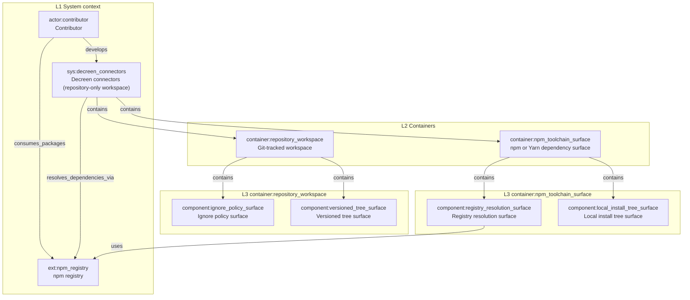

# Live C4 Preview

```mermaid
flowchart TB
  subgraph L1["L1 System context"]
    actor_contributor["actor:contributor<br/>Contributor"]
    ext_npm["ext:npm_registry<br/>npm registry"]
    sys_dc["sys:decreen_connectors<br/>Decreen connectors (repository-only workspace)"]
  end
  subgraph L2["L2 Containers"]
    c_repo["container:repository_workspace<br/>Git-tracked workspace"]
    c_npm["container:npm_toolchain_surface<br/>npm or Yarn dependency surface"]
  end
  subgraph L3_repo["L3 container:repository_workspace"]
    comp_ign["component:ignore_policy_surface<br/>Ignore policy surface"]
    comp_tree["component:versioned_tree_surface<br/>Versioned tree surface"]
  end
  subgraph L3_npm["L3 container:npm_toolchain_surface"]
    comp_reg["component:registry_resolution_surface<br/>Registry resolution surface"]
    comp_local["component:local_install_tree_surface<br/>Local install tree surface"]
  end
  actor_contributor -->|"consumes_packages"| ext_npm
  actor_contributor -->|"develops"| sys_dc
  sys_dc -->|"resolves_dependencies_via"| ext_npm
  sys_dc -->|"contains"| c_repo
  sys_dc -->|"contains"| c_npm
  c_repo -->|"contains"| comp_ign
  c_repo -->|"contains"| comp_tree
  c_npm -->|"contains"| comp_reg
  c_npm -->|"contains"| comp_local
  comp_reg -->|"uses"| ext_npm
```
