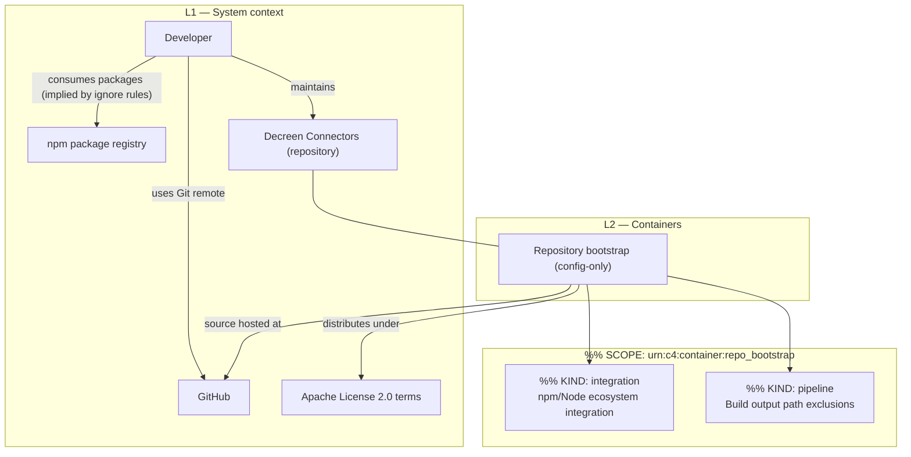

# Live C4 Preview

```mermaid
flowchart TB
  subgraph CTX["L1 — System context"]
    actor_developer["Developer"]
    ext_github["GitHub"]
    ext_npm["npm package registry"]
    ext_license["Apache License 2.0 terms"]
    sys_boundary["Decreen Connectors (repository)"]
  end
  subgraph SYS["L2 — Containers"]
    ctr_bootstrap["Repository bootstrap (config-only)"]
  end
  subgraph L3["%% SCOPE: urn:c4:container:repo_bootstrap"]
    comp_npm["%% KIND: integration\nnpm/Node ecosystem integration"]
    comp_build["%% KIND: pipeline\nBuild output path exclusions"]
  end
  actor_developer -->|"uses Git remote"| ext_github
  actor_developer -->|"consumes packages (implied by ignore rules)"| ext_npm
  actor_developer -->|"maintains"| sys_boundary
  sys_boundary --- ctr_bootstrap
  ctr_bootstrap --> comp_npm
  ctr_bootstrap --> comp_build
  ctr_bootstrap -->|"source hosted at"| ext_github
  ctr_bootstrap -->|"distributes under"| ext_license
```
