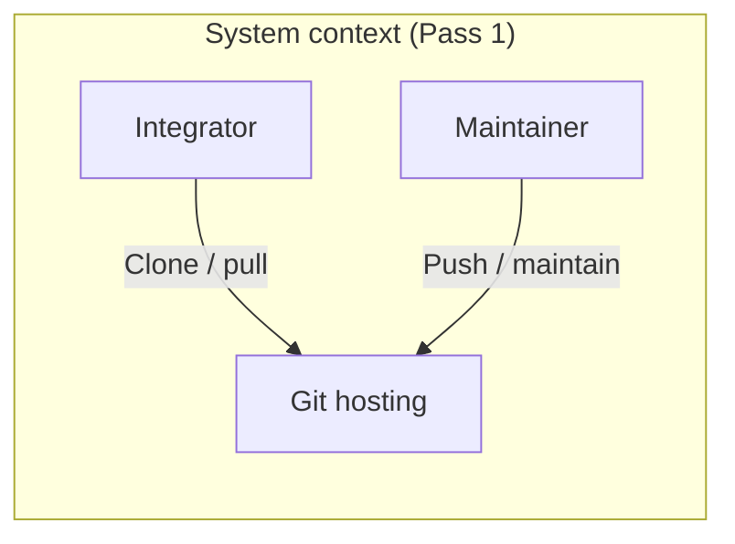

# Live C4 Preview

```mermaid
flowchart LR
  subgraph L1["System context (Pass 1)"]
    integrator["Integrator"]
    maintainer["Maintainer"]
    git_host["Git hosting"]
  end
  integrator -->|"Clone / pull"| git_host
  maintainer -->|"Push / maintain"| git_host
```
