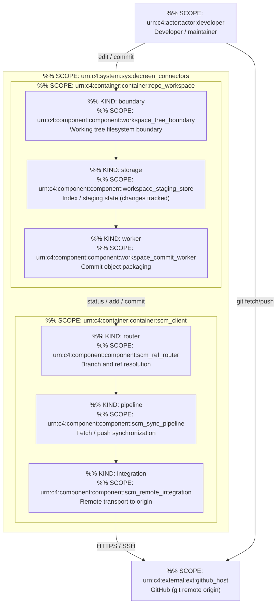

# Live C4 Preview

```mermaid
flowchart TD
  subgraph sys_decreen["%% SCOPE: urn:c4:system:sys:decreen_connectors<br/>Decreen connectors (repository workspace)"]
    subgraph c_repo["%% SCOPE: urn:c4:container:container:repo_workspace<br/>Local repository working tree"]
      comp_wb["%% KIND: boundary<br/>%% SCOPE: urn:c4:component:component:workspace_tree_boundary<br/>Working tree filesystem boundary"]
      comp_ws["%% KIND: storage<br/>%% SCOPE: urn:c4:component:component:workspace_staging_store<br/>Index / staging state (changes tracked)"]
      comp_wc["%% KIND: worker<br/>%% SCOPE: urn:c4:component:component:workspace_commit_worker<br/>Commit object packaging"]
    end
    subgraph c_scm["%% SCOPE: urn:c4:container:container:scm_client<br/>Git client + remote sync"]
      comp_ri["%% KIND: integration<br/>%% SCOPE: urn:c4:component:component:scm_remote_integration<br/>Remote transport to origin"]
      comp_rr["%% KIND: router<br/>%% SCOPE: urn:c4:component:component:scm_ref_router<br/>Branch and ref resolution"]
      comp_sp["%% KIND: pipeline<br/>%% SCOPE: urn:c4:component:component:scm_sync_pipeline<br/>Fetch / push synchronization"]
    end
  end
  actor_developer["%% SCOPE: urn:c4:actor:actor:developer<br/>Developer / maintainer"]
  ext_github["%% SCOPE: urn:c4:external:ext:github_host<br/>GitHub (git remote origin)"]
  actor_developer -->|"edit / commit"| comp_wb
  comp_wb --> comp_ws
  comp_ws --> comp_wc
  comp_wc -->|"status / add / commit"| comp_rr
  comp_rr --> comp_sp
  comp_sp --> comp_ri
  comp_ri -->|"HTTPS / SSH"| ext_github
  actor_developer -->|"git fetch/push"| ext_github
```
